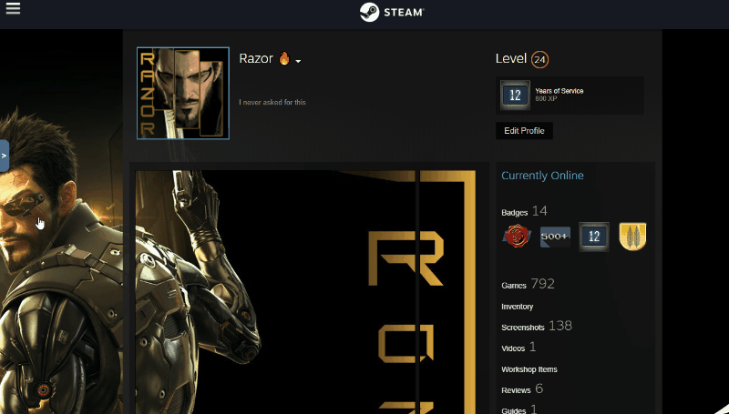

# Steam Art Preview

This is script is intended to preview art in steam profiles, right now only avatars are available to preview

## Usage

1. First, go to any steam profile page.

2. Right click anywhere on the page, click inspect/inspect element then go to the `Console`. Or use Shortcuts for
Chrome `Ctrl+Shift+J` or for FireFox `Ctrl+Shift+K`

3. Paste the content of `script.js` inside your developers console and press Enter